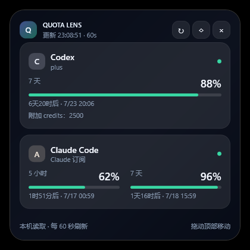

# Quota Lens

English | [简体中文](README.md)

[](https://github.com/Torbjorn-Zhang/quota-lens/actions/workflows/ci.yml)
[](https://github.com/Torbjorn-Zhang/quota-lens/releases)
[](LICENSE)

Quota Lens is a lightweight quota monitor that shows subscription usage, reset times, and remaining quota for **Claude Code** and **Codex**. On Windows it is a translucent desktop widget that can dock as an edge sidebar; on macOS it is a menu bar app.



> [!IMPORTANT]
> This is an unofficial community project. It is not affiliated with or endorsed by Anthropic or OpenAI. The usage endpoints are not stable public APIs and upstream changes may temporarily break the app.

## Features

- Displays the 5-hour, 7-day, and other available quota windows for Codex and Claude Code; a restored Codex short window automatically reappears on the next refresh
- Automatically detects model-family weekly allowances such as the shared Fable bucket (Fable 5 and Fable 5.1 draw from the same allowance), renders one row per family, and hides the rows when none is returned
- Identifies Claude Pro, Max 5×, and Max 20× plans; manual refresh immediately updates both plan and usage
- Shows plan details, reset countdowns, extra credits, and model-specific weekly allowances
- Refreshes Codex every 60 seconds and Claude no more than once every 3 minutes
- Applies 5/10/20/30-minute backoff after Claude HTTP 429 responses while keeping the last successful result
- Low-quota notifications can be disabled from the tray; when enabled, simultaneous alerts are combined and each reset period is notified only once
- Translucent movable widget with always-on-top, tray mode, and opacity controls
- Edge sidebar: dragged to the left or right screen edge, it collapses into a slim strip of concentric ring gauges with reset times, slides the full panel out on hover, and tucks it back when the cursor leaves
- Turns off all displays with one click while preventing automatic system sleep; mouse or keyboard input wakes the displays
- Optional launch at Windows sign-in
- macOS menu bar app: the menu bar icon shows Codex and Claude as two sets of mini concentric rings; one click drops the same dark panel with every quota window's remaining percentage and a live reset countdown
- Never persists OAuth tokens or writes credential/request logs

## Requirements

- Windows 10 or Windows 11 (x64), or macOS 11 or later (Apple Silicon or Intel)
- Codex signed in with a ChatGPT account
- Claude Code signed in with a Claude subscription, or Claude Desktop signed in (the Microsoft Store build on Windows)

API-key, Bedrock, Vertex, and other metered accounts generally do not expose the same subscription quota percentages and are not supported.

## Install

### Windows

1. Download the latest `QuotaLens-*-win-x64.zip` from [Releases](https://github.com/Torbjorn-Zhang/quota-lens/releases).
2. Extract it to a permanent folder.
3. Run `QuotaLens.exe`.
4. Enable “Start with Windows” from the tray menu if desired.

### macOS

1. Download `QuotaLens-*-macos-arm64.zip` (Apple Silicon) or `QuotaLens-*-macos-x64.zip` (Intel) from Releases, unzip it, and drag `QuotaLens.app` into Applications.
2. The app is ad-hoc signed but not notarised by Apple, so macOS blocks the first launch. Choose “Open Anyway” in System Settings → Privacy & Security, or run:

   ```bash
   xattr -dr com.apple.quarantine /Applications/QuotaLens.app
   ```

3. A `C◎ A◎` icon appears in the menu bar; there is no Dock icon. The first time it reads Claude Desktop's sign-in, macOS asks whether Quota Lens may use “Claude Safe Storage” from the keychain; enter your login password and choose “Always Allow”.
4. Launch at login is on after the first run and can be turned off at the bottom of the panel.

The current release is not commercially code-signed, so Windows SmartScreen may show a warning on first launch. Download only from this repository's Releases page, or build from source.

## Use

### macOS

- In the menu bar icon, `C` is Codex and `A` is Claude; each ring set shows the 5-hour window outside, 7 days in the middle, and the model allowance inside, in the same colours as on Windows.
- Click the icon to drop the ring panel below it: one row per quota window with its remaining percentage and a reset countdown that ticks every second (for example “2时1分后 · 10/1 03:40”), matching the Windows panel. Click elsewhere or the icon again to hide it.
- `↻` in the panel refreshes now; the bottom row toggles launch at login and low-quota alerts, and offers display-off-while-awake and quit (labels are in Chinese).

### Windows

- Drag the top header to move the widget.
- Drag it against the left or right screen edge to dock it as a sidebar. It then shows only a slim strip. Codex and Claude each get a set of concentric rings: outer 5-hour, middle 7-day, inner model allowance, with the arc showing the remaining share. Below the rings, one row per window in the same order and colour lists the remaining percentage and the reset time (clock time such as `14:30` within 24 hours, otherwise a date such as `10/3`). Rest the cursor on the strip to slide out the full panel, which tucks back once the cursor leaves. Drag it away from the edge to float it again, or toggle “Edge sidebar” (贴边侧栏) from the tray menu. The docked strip always stays on top.
- Colours identify the quota type and match between the panel and the sidebar: blue for the 5-hour window, violet for 7 days, green for model allowances such as Fable. A ring or bar turns red at 20% or less remaining; percentages turn orange at 40% and red at 20%.
- Select `↻` to refresh and `◇` to toggle always-on-top (floating mode only).
- Select the moon button to turn off the displays while keeping the computer awake.
- `×` hides the window to the tray; choose “Exit” from the tray menu to stop the app.
- Hovering over the widget temporarily increases its opacity.

## Privacy and security

Quota Lens reads the current user's existing sign-in state and sends credentials only to the matching official service:

- Codex: `~/.codex/auth.json` (`%USERPROFILE%\.codex\auth.json` on Windows) or `CODEX_HOME`
- Claude Code: `~/.claude/.credentials.json` or `CLAUDE_CONFIG_DIR`; on macOS also the “Claude Code-credentials” keychain item
- Claude Desktop: Electron safe storage protected by DPAPI on Windows; on macOS, with your approval, the “Claude Safe Storage” keychain password. Both are decrypted only in memory

Tokens are never written to Quota Lens settings or sent to third parties. See the [privacy notes](docs/PRIVACY.en.md) and [security policy](SECURITY.md) for details.

## Build from source

Install the [.NET 6 SDK](https://dotnet.microsoft.com/download/dotnet/6.0), then run:

```powershell
dotnet restore .\QuotaLens.csproj
dotnet build .\QuotaLens.csproj -c Release
dotnet run --project .\QuotaLens.csproj -c Release
```

Run the parser checks:

```powershell
dotnet run --project .\tests\QuotaLens.Tests\QuotaLens.Tests.csproj -c Release
```

Create a single-file release:

```powershell
powershell -ExecutionPolicy Bypass -File .\publish.ps1
```

By default, the Windows output at `artifacts\win-x64-v<version>\QuotaLens.exe` includes the .NET runtime. Pass `-FrameworkDependent` for a smaller framework-dependent build.

Build the macOS app on a Mac with the .NET 6 SDK and the Xcode command line tools:

```bash
./publish-mac.sh osx-arm64
```

This produces `artifacts/mac/osx-arm64/QuotaLens.app` and `artifacts/QuotaLens-v<version>-macos-arm64.zip`. Shared logic lives in `src/QuotaLens.Core`, the Windows UI (WPF) at the repository root, and the macOS UI (Avalonia) in `src/QuotaLens.Mac`.

## Project documentation

- [Architecture](docs/ARCHITECTURE.en.md)
- [Privacy](docs/PRIVACY.en.md)
- [Roadmap](ROADMAP.md)
- [Contributing](CONTRIBUTING.md)
- [Changelog](CHANGELOG.md)
- [Security](SECURITY.md)

## Contributing

Issues and pull requests are welcome. Never include real tokens in screenshots, logs, fixtures, or issues. See [CONTRIBUTING.md](CONTRIBUTING.md) for the full workflow.

## License

[MIT](LICENSE) © 2026 Torbjorn-Zhang
