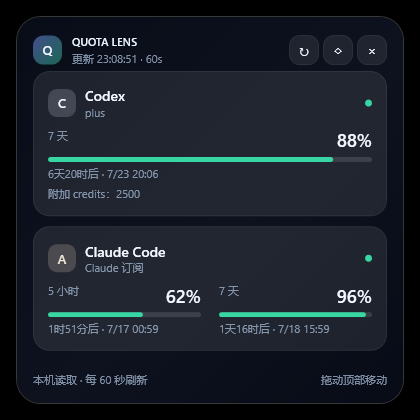

# Quota Lens

[English](README.en.md) | 简体中文

[](https://github.com/Torbjorn-Zhang/quota-lens/actions/workflows/ci.yml)
[](https://github.com/Torbjorn-Zhang/quota-lens/releases)
[](LICENSE)

Quota Lens 是一个轻量、透明的 Windows 桌面小组件，用于实时查看 **Claude Code** 与 **Codex** 的订阅额度、重置时间和剩余比例。



> [!IMPORTANT]
> 本项目是非官方社区工具，与 Anthropic 或 OpenAI 无隶属或背书关系。额度接口并非稳定的公共 API，上游变化可能导致功能暂时失效。

## 功能

- 同时显示 Codex 与 Claude Code 的 5 小时、7 天等额度窗口；Codex 短周期额度恢复后会在下次刷新自动重新显示
- 自动识别并显示 Fable 5 等模型的独立周额度；接口未返回时自动隐藏
- 显示订阅方案、重置倒计时、附加 credits 与模型专项周额度
- Codex 每 60 秒刷新；Claude 最快每 3 分钟刷新
- Claude 遇到 HTTP 429 时自动按 5/10/20/30 分钟退避，并保留上次成功数据
- 可从托盘关闭低额度提醒；开启时会合并同时出现的提醒，同一重置周期只提醒一次
- 透明悬浮窗、置顶、拖动、托盘常驻和透明度调节
- 一键关闭所有显示器，同时阻止系统自动睡眠；鼠标或键盘即可唤醒屏幕
- 可选随 Windows 登录自动启动
- 不保存 OAuth token，不记录请求或凭据日志

## 系统要求

- Windows 10 或 Windows 11（x64）
- 已使用 ChatGPT 账号登录 Codex
- 已使用 Claude 订阅账号登录 Claude Code，或已登录 Microsoft Store 版 Claude Desktop

API key、Bedrock、Vertex 等按量计费账号通常没有相同的订阅额度百分比，因此不在支持范围内。

## 安装

1. 从 [Releases](https://github.com/Torbjorn-Zhang/quota-lens/releases) 下载最新的 `QuotaLens-*-win-x64.zip`。
2. 解压到一个固定目录。
3. 双击 `QuotaLens.exe`。
4. 如需开机启动，在托盘菜单中启用“开机启动”。

当前版本未进行商业代码签名，Windows SmartScreen 可能首次显示提示。请只从本仓库的 Releases 下载，或自行从源码构建。

## 使用

- 拖动顶部标题区域移动小组件。
- 点击 `↻` 立即刷新，点击 `◇` 切换置顶。
- 点击月亮按钮关闭显示器并保持电脑运行。
- 点击 `×` 只会隐藏到托盘；从托盘菜单选择“退出”才会完全结束程序。
- 鼠标移入时会提高不透明度，移出后恢复。

## 隐私与安全

Quota Lens 只读取当前 Windows 用户已有的登录状态，并把凭据直接发送给对应官方服务：

- Codex：读取 `%USERPROFILE%\.codex\auth.json` 或 `CODEX_HOME`
- Claude Code：读取 `%USERPROFILE%\.claude\.credentials.json` 或 `CLAUDE_CONFIG_DIR`
- Claude Desktop：读取由 Windows DPAPI 保护的 Electron 安全存储，仅在内存中解密

token 不会写入 Quota Lens 设置，也不会发送给第三方。详细信息见[隐私说明](docs/PRIVACY.md)和[安全策略](SECURITY.md)。

## 从源码构建

需要 [.NET 6 SDK](https://dotnet.microsoft.com/download/dotnet/6.0)。

```powershell
dotnet restore .\QuotaLens.csproj
dotnet build .\QuotaLens.csproj -c Release
dotnet run --project .\QuotaLens.csproj -c Release
```

运行解析器测试：

```powershell
dotnet run --project .\tests\QuotaLens.Tests\QuotaLens.Tests.csproj -c Release
```

生成单文件发布包：

```powershell
powershell -ExecutionPolicy Bypass -File .\publish.ps1
```

默认生成包含 .NET 运行时的 `artifacts\win-x64-v<版本>\QuotaLens.exe`。使用 `-FrameworkDependent` 可生成较小的框架依赖版本。

## 项目文档

- [架构说明](docs/ARCHITECTURE.md)
- [隐私说明](docs/PRIVACY.md)
- [路线图](ROADMAP.md)
- [贡献指南](CONTRIBUTING.md)
- [变更日志](CHANGELOG.md)
- [安全策略](SECURITY.md)

## 参与贡献

欢迎提交 Issue 和 Pull Request。请勿在截图、日志、测试数据或 Issue 中提交真实 token。完整流程见[贡献指南](CONTRIBUTING.md)。

## 许可证

[MIT](LICENSE) © 2026 Torbjorn-Zhang
