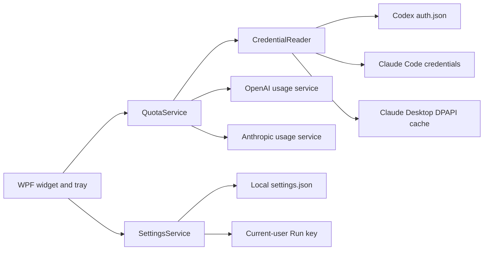

# Architecture

English | [简体中文](ARCHITECTURE.md)

Quota Lens is a single-process WPF desktop application. It has no backend or relay service.

## Components

- `MainWindow.xaml(.cs)`: window, tray, notifications, countdowns, display power, and system-awake behavior.
- `QuotaService.cs`: HTTP calls, response parsing, Claude rate-limit backoff, and friendly error mapping.
- `CredentialReader.cs`: read-only discovery of Codex/Claude login state and in-memory Claude Desktop safe-storage decryption.
- `SettingsService.cs`: non-sensitive UI settings and the current-user startup registry entry.
- `tests/QuotaLens.Tests`: synthetic JSON and temporary encrypted fixtures; no real account is needed.

## Data-flow rules

1. Credentials are read only from the current user's profile.
2. OAuth tokens are attached only to HTTPS requests for the matching official service.
3. Responses are parsed in memory into the common `ProviderQuota` model.
4. The UI receives only quota percentages, reset times, plan details, and friendly errors.
5. Settings never contain tokens, response bodies, or account IDs.

## Runtime policy

- The UI refresh timer runs every 60 seconds.
- Codex is queried on each tick; Claude is queried no more than once every 3 minutes.
- Claude HTTP 429 responses trigger exponential backoff up to 30 minutes while the last successful data remains visible.
- Single-instance protection applies only to `QuotaLens`; it never inspects, terminates, or blocks Claude or Codex processes.
