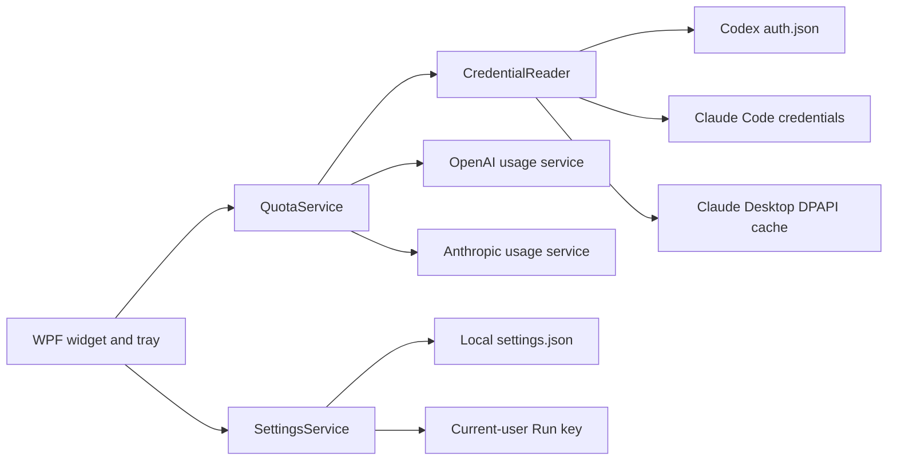

# Architecture

English | [简体中文](ARCHITECTURE.md)

Quota Lens is a single-process WPF desktop application. It has no backend or relay service.

## Components

- `MainWindow.xaml(.cs)`: window, tray, notifications, countdowns, display power, and system-awake behavior.
- `QuotaService.cs`: HTTP calls, response parsing, Claude rate-limit backoff, and friendly error mapping.
- `CredentialReader.cs`: read-only discovery of Codex/Claude login state and in-memory Claude Desktop safe-storage decryption.
- `SettingsService.cs`: non-sensitive UI settings and the current-user startup registry entry.
- `tests/QuotaLens.Tests`: synthetic JSON and temporary encrypted fixtures; no real account is needed.

## Data-flow rules

1. Credentials are read only from the current user's profile.
   Claude plan labels prefer the latest account metadata in `~/.claude.json`; only the plan type and rate-limit tier are retained, never account profile data.
2. OAuth tokens are attached only to HTTPS requests for the matching official service.
3. Responses are parsed in memory into the common `ProviderQuota` model.
4. The UI receives only quota percentages, reset times, plan details, and friendly errors.
5. Settings never contain tokens, response bodies, or account IDs.

The Claude parser reads the standard 5-hour and 7-day windows and also recognizes `weekly_scoped` model allowances in `limits[]`. Each model family (deduplicated by `scope.model.display_name`) gets its own row, with Fable listed first. The usage API currently reports one shared "Fable" bucket that covers both Fable 5 and Fable 5.1 (`model.id` is null); if upstream ever splits them, the extra row appears automatically. When no model-scoped allowance is returned, the extra UI rows stay hidden.

## Runtime policy

- The UI refresh timer runs every 60 seconds.
- Codex is queried on each tick; Claude is queried no more than once every 3 minutes.
- The Codex 5-hour window may be temporarily absent; when the endpoint returns it again, the next refresh automatically restores the two-column layout.
- Claude HTTP 429 responses trigger exponential backoff up to 30 minutes while the last successful data remains visible.
- Manual refresh bypasses the normal three-minute Claude cache but never bypasses HTTP 429 backoff.
- Low-quota notification state and its toggle are stored locally; reset timestamps are normalized to the nearest minute, each quota period is notified once, and simultaneous alerts are combined.
- Single-instance protection applies only to `QuotaLens`; it never inspects, terminates, or blocks Claude or Codex processes.
