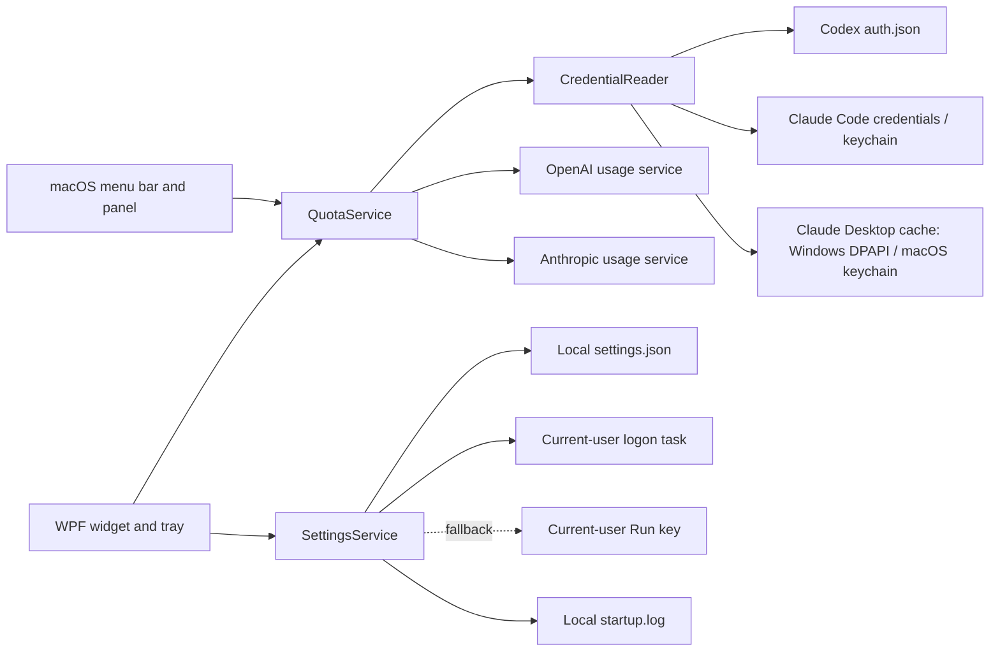

# Architecture

English | [简体中文](ARCHITECTURE.md)

Quota Lens is a single-process desktop application with no backend or relay service. The quota logic lives in the cross-platform `src/QuotaLens.Core` (net6.0) and is shared by two front ends: the WPF app at the repository root on Windows and the Avalonia menu bar app in `src/QuotaLens.Mac` on macOS. The parser checks depend only on Core and run on both the Windows and macOS CI runners.

```mermaid
flowchart LR
    UI[WPF widget and tray] --> QS[QuotaService]
    MAC[macOS menu bar and panel] --> QS
    QS --> CR[CredentialReader]
    CR --> CX[Codex auth.json]
    CR --> CC[Claude Code credentials / keychain]
    CR --> CD[Claude Desktop cache: Windows DPAPI / macOS keychain]
    QS --> OA[OpenAI usage service]
    QS --> AN[Anthropic usage service]
    UI --> SS[SettingsService]
    SS --> FS[Local settings.json]
    SS --> TASK[Current-user logon task]
    SS -.fallback.-> REG[Current-user Run key]
    SS --> LOG[Local startup.log]
```

## Components

- `MainWindow.xaml(.cs)`: window, tray, notifications, countdowns, display power, and system-awake behavior.
- `MainWindow.Dock.cs`: QQ-style edge sidebar. Dragged to the left or right edge of a monitor work area, the widget docks and collapses into a strip of concentric ring gauges with reset times; cursor polling decides when the full panel slides out and back. Snap and release decisions live in the unit-tested `DockPlacement.cs`.
- `QuotaService.cs`: HTTP calls, response parsing, Claude rate-limit backoff, and friendly error mapping.
- `CredentialReader.cs`: read-only discovery of Codex/Claude login state and in-memory Claude Desktop safe-storage decryption.
- `SettingsService.cs`: non-sensitive UI settings and launch at sign-in. When enabled it registers a per-user Task Scheduler logon task (5-second delay, interactive token, no elevation) and removes any legacy Run value; the Run value is only a fallback when Task Scheduler is unavailable.
- `LogonTask.cs`: creates, deletes, and describes the logon task through the `Schedule.Service` COM API via late binding, so no interop assembly is needed.
- `StartupLog.cs`: append-only local diagnostics in `startup.log` (start, exit, autostart registration, unhandled errors) with timestamps, version, arguments, and short messages only; trimmed to the last 200 lines.
- `CredentialReader.cs` (macOS part) and `MacKeychain.cs`: read keychain items through Security.framework. The Claude Desktop cache is decrypted with Chromium's macOS scheme: the “Claude Safe Storage” keychain password goes through PBKDF2-SHA1 (`saltysalt`, 1003 iterations) to a 16-byte key, which decrypts the `v10` payload with AES-128-CBC and an IV of 16 spaces. The keychain prompt blocks the read, so it runs in the background; a caller waits at most 20 seconds and then reports "waiting for approval" while Codex keeps refreshing. After a denial there is no automatic prompt for 30 minutes, and a manual refresh retries at once. The derived key is cached in process memory only, so an "Allow once" answer does not prompt on every refresh.
- `QuotaWindowLegend.cs`: quota-window classification, the palette shared by both front ends (blue 5-hour, violet 7-day, green model allowance, red at 20% or less), and reset-time formatting.
- `src/QuotaLens.Mac`: `QuotaController` owns the menu bar item and menu (a click on a macOS status item only opens its menu, so the menu itself lists every quota window with its reset time); `TrayIconRenderer` draws the `C◎ A◎` ring icon; `PanelView`/`PanelWindow` form the detail panel under the menu bar; `MacPlatform` handles launch at login (a LaunchAgent in `~/Library/LaunchAgents`), notifications (`osascript`), and display-off-while-awake (`caffeinate` + `pmset displaysleepnow`). `--render-preview <dir>` renders the icon, panel, and app icon with sample data to PNG; CI runs it on macOS.
- `tests/QuotaLens.Tests`: synthetic JSON and temporary encrypted fixtures; no real account is needed. The macOS decryption is checked against a known answer produced independently with Python `hashlib` and LibreSSL.

## Data-flow rules

1. Credentials are read only from the current user's profile.
   Claude plan labels prefer the latest account metadata in `~/.claude.json`; only the plan type and rate-limit tier are retained, never account profile data.
2. OAuth tokens are attached only to HTTPS requests for the matching official service.
3. Responses are parsed in memory into the common `ProviderQuota` model.
4. The UI receives only quota percentages, reset times, plan details, and friendly errors.
5. Settings never contain tokens, response bodies, or account IDs.

The Claude parser reads the standard 5-hour and 7-day windows and also recognizes `weekly_scoped` model allowances in `limits[]`. Each model family (deduplicated by `scope.model.display_name`) gets its own row, with Fable listed first. The usage API currently reports one shared "Fable" bucket that covers both Fable 5 and Fable 5.1 (`model.id` is null); if upstream ever splits them, the extra row appears automatically. When no model-scoped allowance is returned, the extra UI rows stay hidden.

## Runtime policy

- The UI refresh timer runs every 60 seconds.
- Codex is queried on each tick; Claude is queried no more than once every 3 minutes.
- The Codex 5-hour window may be temporarily absent; when the endpoint returns it again, the next refresh automatically restores the two-column layout.
- Claude HTTP 429 responses trigger exponential backoff up to 30 minutes while the last successful data remains visible.
- Manual refresh bypasses the normal three-minute Claude cache but never bypasses HTTP 429 backoff.
- Low-quota notification state and its toggle are stored locally; reset timestamps are normalized to the nearest minute, each quota period is notified once, and simultaneous alerts are combined.
- Single-instance protection (an exclusive lock file in the data directory on macOS) applies only to `QuotaLens`; it never inspects, terminates, or blocks Claude or Codex processes.
