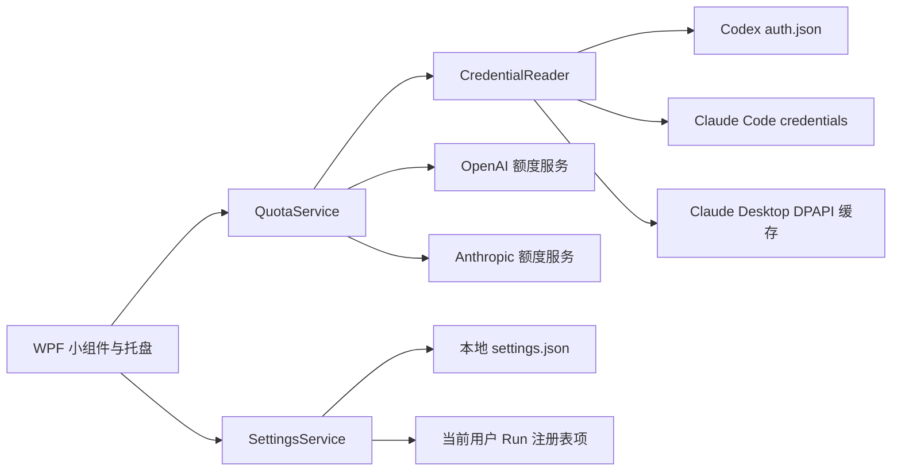

# 架构说明

[English](ARCHITECTURE.en.md) | 简体中文

Quota Lens 是单进程 WPF 桌面应用，没有后台服务器或中转服务。

## 组件

- `MainWindow.xaml(.cs)`：窗口、托盘、通知、倒计时、息屏和系统保持唤醒。
- `QuotaService.cs`：HTTP 请求、响应解析、Claude 限流退避和错误归一化。
- `CredentialReader.cs`：只读发现 Codex/Claude 登录状态，并在内存中解锁 Claude Desktop 安全存储。
- `SettingsService.cs`：保存非敏感界面设置并管理当前用户的开机启动项。
- `tests/QuotaLens.Tests`：使用合成 JSON 和临时加密样本验证解析与凭据选择，不需要真实账号。

## 数据流原则

1. 凭据只从当前用户目录读取。
2. OAuth token 仅加入对应官方服务的 HTTPS 请求头。
3. 响应在内存中解析为通用 `ProviderQuota` 模型。
4. UI 只接收额度百分比、重置时间、方案与友好错误。
5. 设置文件不包含 token、响应正文或账户 ID。

Claude 解析器会读取常规的 5 小时、7 天窗口，也会从 `limits[]` 中识别 `weekly_scoped` 模型额度。存在多个模型额度时优先显示 Fable；没有模型专项额度时，额外界面行保持隐藏。

## 运行策略

- UI 刷新计时器每 60 秒触发一次。
- Codex 每次触发均查询；Claude 最快每 3 分钟查询一次。
- Codex 的 5 小时窗口允许暂时缺席；接口恢复返回该窗口后，下一次刷新会自动恢复双栏显示。
- Claude 429 采用指数退避，最大 30 分钟，并继续显示上次成功结果。
- 低额度提醒状态和开关保存在本地设置中；重置时间按分钟归一化，同一额度周期只通知一次，同时低额度会合并为一条通知。
- 单实例互斥量只限制 `QuotaLens` 自身，不检查、终止或拦截 Claude/Codex 进程。
