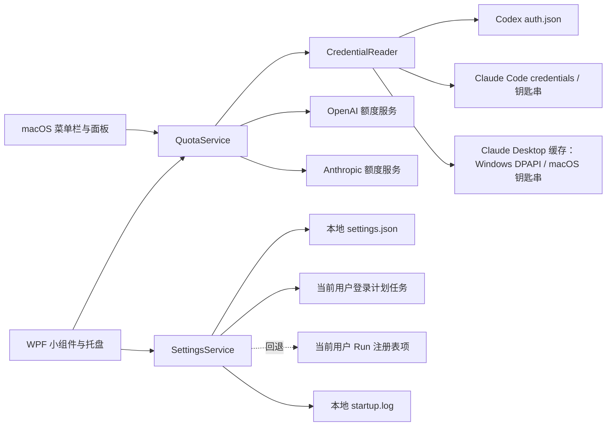

# 架构说明

[English](ARCHITECTURE.en.md) | 简体中文

Quota Lens 是单进程桌面应用，没有后台服务器或中转服务。额度逻辑集中在跨平台的 `src/QuotaLens.Core`（net6.0），由两套界面共用：Windows 版是仓库根目录的 WPF 应用，macOS 版是 `src/QuotaLens.Mac` 的 Avalonia 菜单栏应用。解析器测试只依赖 Core，在 Windows 与 macOS 的 CI 上都会运行。

```mermaid
flowchart LR
    UI[WPF 小组件与托盘] --> QS[QuotaService]
    MAC[macOS 菜单栏与面板] --> QS
    QS --> CR[CredentialReader]
    CR --> CX[Codex auth.json]
    CR --> CC[Claude Code credentials / 钥匙串]
    CR --> CD[Claude Desktop 缓存：Windows DPAPI / macOS 钥匙串]
    QS --> OA[OpenAI 额度服务]
    QS --> AN[Anthropic 额度服务]
    UI --> SS[SettingsService]
    SS --> FS[本地 settings.json]
    SS --> TASK[当前用户登录计划任务]
    SS -.回退.-> REG[当前用户 Run 注册表项]
    SS --> LOG[本地 startup.log]
```

## 组件

- `MainWindow.xaml(.cs)`：窗口、托盘、通知、倒计时、息屏和系统保持唤醒。
- `MainWindow.Dock.cs`：QQ 式贴边侧栏。拖到显示器工作区左/右边缘时贴边并收成同心圆额度竖条（附重置时间），轮询光标位置决定何时滑出完整面板、何时收回；吸附与越界判断在可单测的 `DockPlacement.cs` 中。
- `QuotaService.cs`：HTTP 请求、响应解析、Claude 限流退避和错误归一化。
- `CredentialReader.cs`：只读发现 Codex/Claude 登录状态，并在内存中解锁 Claude Desktop 安全存储。
- `SettingsService.cs`：保存非敏感界面设置并管理开机启动。启用时注册当前用户的 Task Scheduler 登录任务（延迟 5 秒、交互令牌、不提权）并清除旧的 Run 注册表值；Task Scheduler 不可用时回退到 Run 值。
- `LogonTask.cs`：通过 `Schedule.Service` COM 接口（后期绑定，无需 interop 程序集）创建、删除和查询登录任务。
- `StartupLog.cs`：追加式本地诊断日志 `startup.log`，记录启动、退出、自启注册与未处理错误，只含时间、版本、参数和简短信息，保留最近 200 行。
- `CredentialReader.cs`（macOS 部分）与 `MacKeychain.cs`：通过 Security.framework 读取钥匙串项。Claude 桌面版缓存按 Chromium 的 macOS 方案解密：钥匙串“Claude Safe Storage”密码经 PBKDF2-SHA1（`saltysalt`，1003 轮）派生 16 字节密钥，再用 AES-128-CBC（IV 为 16 个空格）解开 `v10` 数据。钥匙串授权对话框会阻塞读取，因此读取在后台进行，调用方最多等 20 秒后提示“正在等待授权”，Codex 照常刷新；拒绝授权后 30 分钟内不再自动弹窗，手动刷新可立即重试。派生出的密钥只在进程内存中缓存，避免“仅允许一次”时反复弹窗。
- `QuotaWindowLegend.cs`：额度类型分类、两端共用的配色（蓝 5 小时、紫 7 天、绿模型专项，≤20% 红）与重置时间格式。
- `src/QuotaLens.Mac`：`QuotaController` 管理菜单栏图标与菜单（macOS 上点击状态栏图标只会弹出菜单，因此菜单本身逐行列出额度与重置时间），`TrayIconRenderer` 绘制 `C◎ A◎` 同心圆图标，`PanelView`/`PanelWindow` 是菜单栏下方的详情面板，`MacPlatform` 负责登录启动（`~/Library/LaunchAgents` 中的 LaunchAgent）、通知（`osascript`）与息屏保持唤醒（`caffeinate` + `pmset displaysleepnow`）。`--render-preview <目录>` 用示例数据渲染图标、面板与应用图标 PNG，CI 会在 macOS 上运行它。
- `tests/QuotaLens.Tests`：使用合成 JSON 和临时加密样本验证解析与凭据选择，不需要真实账号；macOS 解密用 Python `hashlib` 与 LibreSSL 独立生成的已知答案校验。

## 数据流原则

1. 凭据只从当前用户目录读取。
   Claude 方案名称优先读取 `~/.claude.json` 的最新账户元数据，仅保留方案类型与限额档位，不保存账户资料。
2. OAuth token 仅加入对应官方服务的 HTTPS 请求头。
3. 响应在内存中解析为通用 `ProviderQuota` 模型。
4. UI 只接收额度百分比、重置时间、方案与友好错误。
5. 设置文件不包含 token、响应正文或账户 ID。

Claude 解析器会读取常规的 5 小时、7 天窗口，也会从 `limits[]` 中识别 `weekly_scoped` 模型额度。每个模型家族（按 `scope.model.display_name` 去重）各占一行，Fable 排在最前；usage 接口目前用同一个 "Fable" 桶覆盖 Fable 5 与 Fable 5.1（`model.id` 为 null），若上游拆成多个桶，界面会自动新增行。没有模型专项额度时，额外界面行保持隐藏。

## 运行策略

- UI 刷新计时器每 60 秒触发一次。
- Codex 每次触发均查询；Claude 最快每 3 分钟查询一次。
- Codex 的 5 小时窗口允许暂时缺席；接口恢复返回该窗口后，下一次刷新会自动恢复双栏显示。
- Claude 429 采用指数退避，最大 30 分钟，并继续显示上次成功结果。
- 用户手动刷新会绕过正常的 3 分钟 Claude 缓存，但不会绕过 429 退避。
- 低额度提醒状态和开关保存在本地设置中；重置时间按分钟归一化，同一额度周期只通知一次，同时低额度会合并为一条通知。
- 单实例互斥量（macOS 上为数据目录中的独占锁文件）只限制 `QuotaLens` 自身，不检查、终止或拦截 Claude/Codex 进程。
